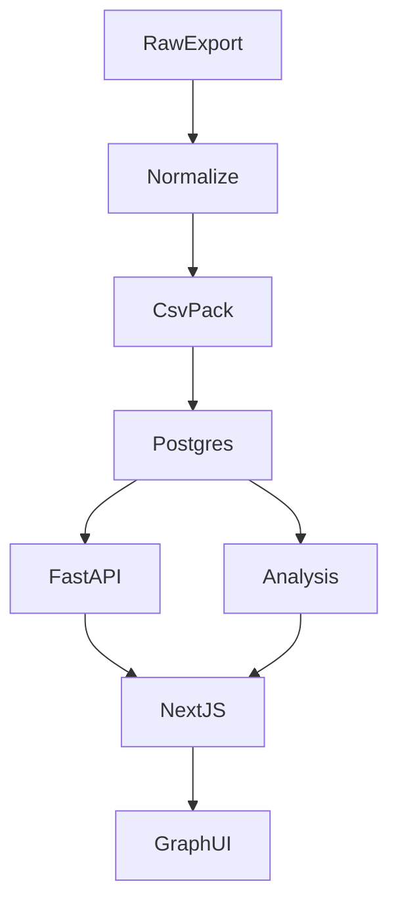

# 3.0 股权全景结构化：总览规划

## 范围
- 以“30 家目标公司”为基准，构建可查询、可视化、可统计的**股权全景结构**（上游股东 + 下游投资）。
- 只定义本功能（3.x）的**数据口径、导入流程、API/前端契约、QA 与验收**，用于指导实现与联调。
- 不在本规划中强制绑定数据来源实现方式；但默认采用“网页导出/半自动清洗”的合规路径，避免大规模自动化抓取带来的风控问题。

## 交付物
- `3.a` 数据契约与字段字典（CSV/JSON 同源口径）。
- `3.b` 导入与清洗流程（目录规范、消歧策略、入库顺序）。
- `3.c` 后端 API 契约（路由、参数、响应结构、截断提示）。
- `3.d` 前端页面与图谱组件契约（路由、交互、性能策略）。
- `3.e` QA 与验收清单（覆盖率、一致性、异常、循环持股等）。

## 默认口径（必须全链路一致）
- **批次（snapshot）隔离**：所有查询/页面默认按 `snapshot_name` 过滤，避免多批次混杂。
- **下游递归阈值**：`min_pct=0.2`（即 **20%**）。建议作为查询参数，而非入库过滤条件。
- **扩张控制**：对超大集团必须启用 `max_depth` / `max_nodes` 截断，并在响应与页面提示“已截断”。
- **上游穿透**：上游沿股东链穿透，遇到“终点主体类型”（自然人/国资/上市/境外/基金等）可停止并记录类型（实现细节由后端决定，但验收要可体现）。

## 端到端数据流

## 里程碑（建议实现顺序）
1. **数据口径先行**：完成 `3.a`，把 CSV 与 API 输出 JSON 的字段与约束“锁死”。
2. **导入可跑通**：完成 `3.b`，用 1~2 家公司小样跑通导入与最小 QA。
3. **最小后端可用**：完成 `3.c` 的 MVP 接口：`/api/targets`、`/api/entities/search`、`/api/graph/ownership`。
4. **最小前端可看**：完成 `3.d` 的 MVP 页面：目标列表 + 公司详情图谱页（含截断提示）。
5. **验收闭环**：完成 `3.e`，把覆盖率/一致性/异常/循环持股等 QA 跑通并可复现。

## 分规划索引
- [规划/3.a_3.0-数据契约与字段字典.md](规划/3.a_3.0-数据契约与字段字典.md)
- [规划/3.b_3.0-导入流程与数据清洗规范.md](规划/3.b_3.0-导入流程与数据清洗规范.md)
- [规划/3.c_3.0-后端API契约与查询参数.md](规划/3.c_3.0-后端API契约与查询参数.md)
- [规划/3.d_3.0-前端页面与图谱组件契约.md](规划/3.d_3.0-前端页面与图谱组件契约.md)
- [规划/3.e_3.0-QA与验收标准.md](规划/3.e_3.0-QA与验收标准.md)

## 端到端验收串联（最小可验收闭环）
- **数据**：`entities.csv`、`equity_edges.csv`（可选 `targets.csv`）按 `3.a` 字段约束产出，且消歧/冲突输出可追溯。
- **入库**：按 `3.b` 顺序完成导入；30 家目标公司能关联到主体 `entity_id`（或明确缺失原因）。
- **API**：按 `3.c` 返回标准 `nodes/edges`，支持 `direction=up|down`、`min_pct/max_depth/max_nodes`，并在截断时给出提示字段。
- **前端**：按 `3.d` 展示目标列表与公司图谱页；阈值与截断参数可控且可复现。
- **QA**：按 `3.e` 通过覆盖率/比例异常/重复边/循环持股等校验点，并能用同一过滤条件复现页面子图。

## 最终用户可见成果形态（推荐）
完成 3.0 全部功能后，对“业务用户/管理层”可见的最终成果建议包含 **工作台 + 公司全景 + 对比 + 可复现导出** 四类。

### A) 股权全景工作台（总入口）
- 入口页形态：建议落在 `/analysis`（或其子路由）作为全景入口。
- 内容：
  - 地区/行业/主体类型分布（来自 `3.c` 的 `/api/analysis/summary`）
  - 覆盖率、异常数、循环持股数、平均深度/节点数、截断比例等指标卡（部分可从 QA 与 stats 汇总得到）
  - 点击分布项可联动过滤目标公司列表（跳转 `/targets` 并带查询条件）

### B) 目标公司总览 + 公司全景页（主流程）
- `/targets`：目标公司列表（支持地区/行业/标签筛选），点击进入公司详情页。
- `/targets/[id]`：公司全景页：
  - 上游/下游切换
  - 参数：`min_pct/max_depth/max_nodes`
  - 图谱 + 侧栏主体详情
  - 明确的截断提示与调参引导（与 `stats.truncated/truncate_reason` 对齐）

### C) 公司对比页（强烈建议，体现“全景”价值）
- 建议新增 `/compare`（或 `/analysis/compare`）：
  - 选择公司 A 与 B
  - 输出：共同股东/共同被投、结构深度与境外链路差异、循环风险差异
  - 用于汇报/研判场景，比单图谱更“可决策”

### D) 导出/下载（从“数据下载”升级为“可复现分析包”）
至少提供三层导出能力（从轻到重）：
- 当前子图导出：`nodes/edges + params + snapshot_name + stats(truncated)`（JSON，可复现当时所见）
- 标准化表下载：`entities.csv`、`equity_edges.csv`、（可选）`targets.csv`
- QA 报告包（可选增强）：覆盖率/比例异常/重复边/循环持股清单 + 汇总报告（用于验收与审计归档）

## 关键参数一致性检查清单（实现/联调必做）
- `snapshot_name`：
  - 导入产物（CSV）里每行都有且一致
  - 后端所有接口都要求/默认该参数，并在响应 `snapshot.name` 回传
  - 前端页面在显著位置展示当前批次，并在切换批次时清空旧结果
- `min_pct`（默认 0.2）：
  - 前端控件默认值与后端默认值一致
  - 后端响应 `params.min_pct` 必须回传，便于 QA 对照
  - QA 用“提高 min_pct 节点减少”的可复现实验验证其生效
- `max_depth/max_nodes`：
  - 前端控件可调，且请求参数与后端一致
  - 后端在触发截断时必须返回 `stats.truncated=true` 与 `stats.truncate_reason`
  - 前端必须在 `truncated=true` 时提示“已截断”并引导用户调整参数

## 风险与依赖
- **数据合规与风控**：默认“半自动导出”，如改为自动抓取需单独评审合规风险。
- **消歧成本**：信用代码缺失/冲突将引入 `conflicts/` 人工复核步骤；需在排期中预留时间。
- **图谱爆炸**：必须强制截断与提示；否则前后端都会出现性能与稳定性问题。
