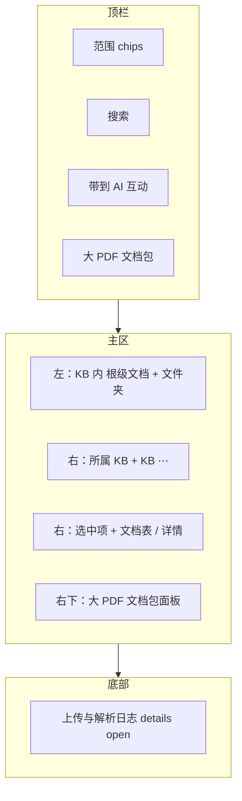

# 知识库 Tab 布局与交互 v3 设计稿

日期：2026-04-28  
范围：`frontend/app/knowledge/page.tsx`、`frontend/app/ai-interaction/page.tsx`（上传归档与引用入框）、`frontend/app/lib/kb_scope_capsule.ts`（可选扩展）、`frontend/app/components/KnowledgeWorkspacePanel.tsx`（若仅透传则无改）  
状态：**待你确认后再开发**

---

## 1. 背景与目标

在 v2「方案 A」基础上，进一步：

1. **AI 互动上传**的文档**直接进入私人知识库**（与「未归类」概念解耦后的数据模型一致：仍属用户私有文档，可暂无 `folder_id`）。
2. **取消「未归类文档」产品概念**：不再使用虚拟 `__unclassified__` 节点；在**私人知识库**左栏中，**根级文档**（无文件夹绑定）与**文件夹**并列展示——**根级文档在上、文件夹在下**。
3. **去掉包裹整块内容的「大 frame」卡片**（去一层 `rounded-lg border … bg-zinc-900/50` 的外壳），**全宽利用页面**；保留必要分区即可。
4. **范围 chips 默认选中**且顺序固定为：**私人知识库 → 部门公共库 → 项目公共库（仅当当前用户存在任一项目公共库权限时显示该 chip）→ 公司公共库**。未在默认集合内的 kind 仍可出现在 chips 中（靠后），或按产品决策隐藏至「更多」——**推荐**：仅展示用户可见的 kind，默认四项如上，其余按需展示。
5. **顶栏搜索框之后**仅保留：**带到 AI 互动**、**大 PDF 文档包**（原「大 PDF 产物」改名）。其余顶栏按钮（如顶栏「上传」、顶栏「新建文件夹」、全局 ⋯ 等）**移除或迁移**到右栏上下文菜单（见 §4）。
6. **大 PDF 文档包**：不再使用居中 Modal；改为在**页面下方右侧区域**展示（与「上传与解析日志」同一大区内的上下或左右分栏，见 §3.3）。
7. **左侧树**行内 **⋯ 去掉**；选中某文档或文件夹后，在**右侧栏**展示该对象详情区顶部的 **⋯**（文档菜单 / 文件夹菜单）。**右侧上部**始终展示当前选中项所属的**知识库（kind）**；其旁 **大号按钮**打开**当前知识库范围**的菜单（如：在该 KB 下新建文件夹、刷新、帮助链接等——与现有「知识库旁 ⋯ 创建文件夹」能力对齐）。
8. **Tab 内正文字号整体升一级**（例如 `text-sm`→`text-base`，`text-xs`→`text-sm`，标题按比例放大）。
9. **「上传与解析日志」默认展开**（`<details open>`）。

---

## 2. 信息架构（线框）

### 2.1 整页自上而下（无外层大 frame）

```
┌──────────────────────────────────────────────────────────────────────────────┐
│ [私人] [部门公共] [项目公共*] [公司公共]   [ 搜索……… ]  [带到AI互动] [大PDF文档包]   │
├───────────────────────────────┬──────────────────────────────────────────────┤
│ 左：当前 KB 内结构              │ 右：上下文区                                  │
│ · 根级文档（仅私人 KB 有）      │ 顶：所属知识库：私人知识库  [ KB 大 ⋯ 菜单 ]   │
│ · 文件夹 A                    │ 中：选中项标题 + 文档 ⋯ / 文件夹 ⋯           │
│ · 文件夹 B（合同管理）         │ 下：文档表 / 文件夹摘要 / 空状态              │
│                               ├──────────────────────────────────────────────┤
│                               │ 右下：大 PDF 文档包（列表，原 Modal 内容）      │
├───────────────────────────────┴──────────────────────────────────────────────┤
│ <details open> 上传与解析日志 …                                               │
└──────────────────────────────────────────────────────────────────────────────┘
```

\*「项目公共」chip 仅当 `me.projects` 等判定用户具备项目公共库入口时渲染（与现有数据一致即可）。

### 2.2 私人知识库左栏（根级在上、文件夹在下）

```
私人知识库
  ├─ （根级文档行）文件1.pdf
  ├─ （根级文档行）文件2.xlsx
  ├─ 📁 合同管理
  └─ 📁 …
```

其他 KB：仅文件夹列表（无根级区，或根级区为空则隐藏）。

---

## 3. 关键交互与数据流

### 3.1 AI 互动上传 → 私人知识库

- **行为**：上传成功即视为用户私有文档；**不强制**写入某一文件夹（与「根级文档」模型一致）。
- **若已有逻辑**：上传后归档到私有 KB，保持并核对与 `folder_ids` 为空一致。
- **验收**：在 AI 互动上传后，知识库「私人」下**根级文档列表**可见该文件（或刷新后可见）。

### 3.2 带到 AI 互动

- **入口**：顶栏按钮（搜索框后保留的两项之一）。
- **行为**：跳转 `/ai-interaction`，且**当前在知识库中选中的文档**应在聊天侧**以引用形式出现在输入区**（与现有「附件 / 引用」机制对齐）。
- **技术草案**（二选一，实现时择一写清）：
  - **A**：扩展 URL，如 `?doc_ids=id1,id2` + AI 页 `useEffect` 拉取元数据并写入 `composerAttachments`；
  - **B**：扩展 `KbScopeCapsule` 增加 `doc_ids: string[]` + `readKbScopeCapsule` 在 AI 页 hydrate。
- **验收**：多选文档 → 带到 AI → 输入框上方/内可见引用 chips，发送前可见。

### 3.3 大 PDF 文档包（右下栏，非 Modal）

- **入口**：顶栏「大 PDF 文档包」为 **toggle** 或 **切换右下分区**：展开时在**右栏下半**展示原 Modal 内列表（包名、导出类型、行内 ⋯）；折叠时仅显示窄条标题栏。
- **推荐**：与「上传与解析日志」同属页面底部区域：日志在**全宽**底部；**大 PDF 区块**占**右半屏宽**或与右栏对齐，避免与左栏树抢宽度（具体 CSS 在实现计划中定稿）。

### 3.4 左侧 ⋯ 迁移到右侧

- **左栏**：仅展示名称、可选选中高亮、可选多选 checkbox；**无 ⋯**。
- **右栏**：选中单个文档或文件夹时，**该对象标题行右侧**显示 **⋯**（移动/复制/删除/分享等沿用现有 API）。
- **KB 大按钮 ⋯**：对应当前选中项所在 **kb_kind** 的「库级」操作（如：在该库新建文件夹、与现有 kb 菜单合并）。

---

## 4. 默认 chips 与顺序

固定顺序（仅渲染用户有权限的项；无项目则不出「项目公共」chip）：

1. `Private` — 私人知识库  
2. `DeptPublic`（或后端实际部门公共 kind 字符串）— 部门公共库  
3. `ProjectPublic` — 条件显示  
4. `CompanyPublic` — 公司公共库  

**默认选中**：上述可见项**全部选中**（与用户需求一致）。  
**实现注意**：与 `sortKbKindsPinned` 的「私人/公司置顶」不冲突——此处顺序为**产品指定顺序**，以本稿为准。

---

## 5. 字号与日志

- **字号**：全局提升一级（Tailwind 语义映射表在计划中列出）。
- **日志**：`<details id="kb-upload-log" open>` 默认展开。

---

## 6. 待你确认（1 个产品决策）

**大 PDF 文档包与右栏关系**：你更倾向哪种？

- **方案 1（推荐）**：顶栏「大 PDF 文档包」切换**右栏下半区**显示列表（主内容区仍是文档表）；底部日志仍全宽。  
- **方案 2**：大 PDF 与日志并排同在**页面最底部**（右半 PDF、左半日志）。

回复 `1` 或 `2` 即可；若不回复，按 **方案 1** 实现。

---

## 7. 自审

- 与「取消未归类」一致：根级文档仍可无 `folder_id`，仅 UI 不再叫「未归类」、不用虚拟 folder id。  
- `UNCLASSIFIED_FOLDER_ID` 将删除，相关 `useEffect`/路由需收敛到「私人根级 + 文件夹」选择模型。  
- 多选 + 带到 AI：需定义多选时右栏展示聚合标题或首张文档为主。

---

## 8. 线框图（Mermaid）



文档版本：v3-draft-1
