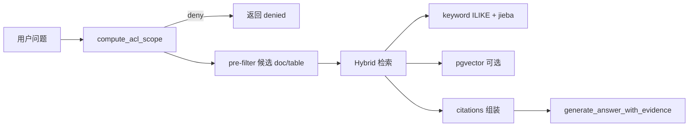

# RAG 实现现状与 1.2.0.c / 1.2.0.d 差距

| 字段 | 值 |
|------|-----|
| **status** | `living`（随代码更新） |
| **对照规划** | `规划/1.2.0.c-文档入库流程与产物包对接规划.md`、`规划/1.2.0.d-RAG检索策略与引用审计规划.md` |
| **主实现** | `backend/services/knowledge_pipeline.py`、`backend/services/kb_vector_store.py`、`backend/routers/knowledge.py`、`backend/routers/ai_interaction.py` |

---

## 0. 与同类项目通行做法（简评）

| 维度 | 本仓库现状 | 企业内网 RAG 常见做法 | 评价 |
|------|------------|----------------------|------|
| 权限 | ACL pre-filter → 检索 | 检索前过滤（RBAC/ABAC） | ✅ 符合 |
| 检索 | 关键词 + 可选 pgvector hybrid | Hybrid 为主流 | ✅ 符合 |
| 重排 | 规则/词频 boost，无 cross-encoder | 规模上来后常加 rerank | 🟡 可后置 |
| 引用 | doc_chunk + table 行级 | 结构化 citation | 🟡 够用，字段可再丰富 |
| 审计 | retrieve 有；answer 不全 | 合规场景常要全链路 | 🟡 内网建议补 answer 审计 |
| 入库 | bigpdf 有流水线；通用文档无完整 manifest 机 | 产物包 + 状态机 | 🟡 大 PDF 已对齐方向 |

结论：**主链路符合内网知识库/RAG 的通行架构**；与 LangChain/LlamaIndex 等「全家桶」相比更偏自研薄封装，适合可控与 ACL，但观测与入库规范化仍弱于成熟商业方案。

---

## 1. 当前 RAG 架构（简述）

1. **ACL**：`knowledge_acl.compute_acl_scope` + `ask_knowledge` 内子集校验（`selected_collection_ids` / `attached_doc_ids`）。
2. **文档检索**：在 `allowed_doc_ids` 上先做候选集，再 **关键词 + 向量混合**（`_hybrid_retrieve`），fixtures 文档并行关键词检索。
3. **表格**：`retrieve_table_evidence`（结构化表实例，非向量全文）。
4. **向量**：`kb_doc_chunk_embeddings` + `KB_VECTOR_ENABLED`；未启用时仅关键词/fixtures。
5. **入口**：`POST /api/knowledge/ask`、`POST /api/ai-interaction/chat`（带 `kb_scope` 时走 `ask_knowledge`）。
6. **审计**：`rag_audit_bridge` 统一写入；`/knowledge/ask` 与 `/ai-interaction/chat`（含直连/纯对话）均覆盖 `knowledge.retrieve.*` 与 `ai.answer.*`。

大 PDF 入库见 [`1.2.2.g-大PDF解析流程重构方案.md`](1.2.2.g-大PDF解析流程重构方案.md)（Docling → `kb_rag_packages` / 私人文件夹绑定）。

---

## 2. 相对 1.2.0.c（文档入库）— 已实现 / 未实现

| 规划项 | 状态 | 说明 |
|--------|------|------|
| 标准产物包目录 `raw/archive/kb/sections/manifest` | 🟡 | **大 PDF** 路径接近；普通上传文档未必全量 manifest 状态机 |
| 状态机 uploaded→parsed→packaged→assigned→delivered→active | 🟡 | **`kb_doc_lifecycle`** 约束 `ud_*` 主路径；`delivered` 导出 zip 未做 |
| 多租户目录与 manifest 字段 | 🟡 | tenant 在 DB/路径有；manifest 规范未统一验收 |
| 上传→私有→分配→交付 zip | 🟡 | 私有/分配有；**Open WebUI 自动导入**未做，以下载/本系统检索为主 |
| 表实例 stored→assigned→active | 🟡 | data_parse 可持久化表；与规划「用户勾选存入 KB」部分对齐 |
| 外部消费端导入 Open WebUI | ❌ | 规划已调整为导出包 + 外部手工导入 |
| 章节分段默认、非整文零切块 | 🟡 | bigpdf/解析有 chunk；旧文档可能整段上传 |

---

## 3. 相对 1.2.0.d（RAG 检索）— 已实现 / 未实现

| 规划项 | 状态 | 说明 |
|--------|------|------|
| Pipeline：intent → ACL → retrieve → citation → answer → audit | 🟡 | 主链路有；audit 不完整 |
| pre-filter 必选（collection/doc/table scope） | ✅ | `ask_knowledge` 内 enforced |
| empty scope → deny | ✅ | `denied` + `deny_reason` |
| 向量检索 + metadata filter | 🟡 | pgvector 在候选 `doc_id` 上检索；非全库 metadata filter 表达式 |
| 关键词 / BM25 + 向量 Hybrid | ✅ | `_hybrid_retrieve` |
| rerank（交叉编码器等） | ❌ | 仅 section 内轻量 boost |
| citation 对象（doc/chunk/table/row_key） | 🟡 | doc_chunk + table 有；`section_id`/aggregation 部分缺 |
| 审计 knowledge.retrieve.attempt/deny | ✅ | `knowledge.py` |
| 审计 ai.answer.generate/deny | ✅ | `rag_audit_bridge` + chat/ask 路由 |
| 混合意图分源记录 | 🟡 | 单次 citations 合并，审计未分源摘要 |
| table content QA（行级证据） | 🟡 | `retrieve_table_evidence` 有；深度数值问答有限 |
| 不在审计中写 chunk 明文 | ✅ | 设计意图；需持续遵守 |

---

## 4. 未实现项是否继续推（建议优先级）

| 项 | 价值 | 建议 |
|----|------|------|
| **1.2.0.d** `ai.answer.*` 全链路审计 | 高（内网合规、排障） | **建议推**：工作量中等，与现有 retrieve 审计对称 |
| **1.2.0.d** rerank（交叉编码器） | 中（召回已 hybrid 时边际递减） | **按需**：问答质量瓶颈明确再做 |
| **1.2.0.d** citation `section_id` 等 | 中（引用可读性） | 与前端展示一起小步做 |
| **1.2.0.c** 通用文档 manifest 状态机 | 中（运维、可观测） | **可分批**：先规范 bigpdf + 新上传，旧文档兼容 |
| **1.2.0.c** Open WebUI 自动导入 | 低（规划已改为手工导出） | **不建议推**，除非产品重新绑定 OWUI |
| **1.2.0.c** 旧文档重切块 | 中（检索质量） | 后台任务，与向量重建一并规划 |

## 5. 文档索引

- 本文（living 差距）
- 规划：`规划/1.2.0.c-*`、`规划/1.2.0.d-*`
- 大 PDF baseline：`1.2.2.g-大PDF解析流程重构方案.md`
- 开发手册：`docs/kb-vector-dev-setup.md`
