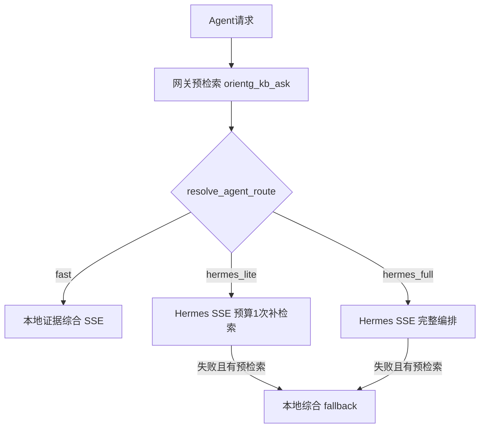

# Agent KB 智能分流（方案三）设计说明

**日期：** 2026-05-27  
**状态：** draft（路由规则已由 [1.2.3.b Evidence Pack + Tier](1.2.3.b-agent-evidence-pack-tiers.md) 扩展）  
**关联：** [1.2.3 Hermes 融合方案](1.2.3-Hermes-Agent与Orient-G融合方案.md)、[1.2.3.b Evidence Pack + Tier](1.2.3.b-agent-evidence-pack-tiers.md)、[实施计划](../plans/1.2.3-agent-kb-router-plan.md)、[hermes.md](../../docs/hermes.md)

---

## 1. 问题与目标

**问题：** 当前 `HERMES_AGENT_KB_FAST_PATH=false` 时，网关预检索后仍进入 Hermes 全量多轮 MCP，常见 3–10+ 分钟无正文输出，仅心跳提示。`FAST_PATH=true` 则跳过 Hermes，无法满足「多轮核实」诉求。

**目标：** 在保留生产架构（Orient-G → Hermes → MCP orientg → PostgreSQL）前提下：

- **v1.2.3.b 起标准模式默认**走 **Tier 0**（多 query 预检索 + Evidence Pack + 本地综合）；证据不足或需编排时升 **Hermes 受限（Tier 1）**；
- **简单只读问答**走 **Fast**（秒级～两分钟）；
- **写库 / 无 KB / 用户深度模式**走 **Hermes 完整**；
- 支持 **问句意图自动分流 + Agent 页显式模式开关**。

**非目标（YAGNI）：**

- 不替换 Hermes 为自建 Agent 框架；
- v1 不要求改 Hermes 源码，仅 Orient-G 注入约束 + 文档化 Hermes 配置项；
- 不做通用 NLU 模型，用规则 + 关键词 + 预检索信号。

---

## 2. 三路路由定义

| 路由 | 代号 | 何时选用 | 行为 |
|------|------|----------|------|
| 快速 | `fast` | 简单单点 KB 只读 + 证据充足 + 用户未选「深度」 | 预检索 → `_top_citations_for_llm` → `synthesize_kb_reply` → SSE；`hermes_used=false` |
| 标准（默认） | `hermes_lite` | 有 KB 范围且 Hermes 可用，且非写库/非强制深度 | 预检索（含证据摘要注入）→ Hermes SSE；system 限制重复 `orientg_kb_ask`，**补检索预算 ≤1** |
| 深度 | `hermes_full` | 无 KB、写库意图、或用户选「深度核实」、或 Hermes 必需的多工具任务 | 预检索（若有范围）→ Hermes **完整**工具环；不强制 kb_ask 上限 |

---

## 3. 路由决策规则（确定性）

新增 [`backend/services/agent_kb_router.py`](../../../backend/services/agent_kb_router.py)（拟建）：

**输入：**

- `user_query`、`kb_scope`、`allow_kb_write`
- `prefetch_result`（ok / denied / citations 数量）
- `agent_mode`：`auto` | `fast` | `standard` | `deep`（来自前端）
- `settings`：`hermes_configured`、`hermes_agent_kb_prefetch`

**优先级（高 → 低）：**

1. 无 KB 范围且无附件 → `hermes_full`（或 `local_llm` 现有分支，不变）
2. `allow_kb_write` 且 `query_implies_kb_write` → `hermes_full`
3. `agent_mode == "fast"` 且预检索有 citations → `fast`
4. `agent_mode == "deep"` → `hermes_full`
5. `agent_mode == "standard"` 或 `auto` 默认 → `hermes_lite`
6. `auto` 下若命中 **简单问句** 且 citations ≥ 3 且无复杂意图 → `fast`
7. 其余 → `hermes_lite`

**简单问句（fast 候选）：**

- 匹配：单年单指标（如「华清25年营收」「T+2 是什么意思」）
- 不匹配关键词：`对比|比较|两年|核实|再查|验证|上传|指派|合并.*母公司` 等
- 预检索未 denied

**复杂问句（保持 hermes_lite，不升格 full）：**

- 对比表、两年、损益、口径切换
- 用户 `standard` 默认即走 hermes_lite，由 Hermes 决定是否再 ask 一次

---

## 4. Hermes 受限（hermes_lite）契约

### 4.1 Orient-G 侧

1. **预检索摘要升级**（[`agent_kb_prefetch.py`](../../../backend/services/agent_kb_prefetch.py)）  
   - 在注入 Hermes 的 system 中增加 `evidence_excerpts`：Top-4 chunk 节选（沿用 `_focus_financial_compare_excerpt` / 上限 4k 字/chunk）。  
   - JSON 字段：`orientg_route: "hermes_lite"`、`orientg_kb_ask_budget: 1`。

2. **system 指令**（[`agent_kb_fast_path.prefetch_system_lead`](../../../backend/services/agent_kb_fast_path.py) 扩展）  
   - 已有「勿重复相同 ask」；补充：「已提供 excerpt 时优先直接作答；仅当 excerpt 明显缺字段时可再 ask，且整个会话 orientg_kb_ask 最多再调用 1 次」。

3. **SSE 元数据**  
   - `done` 事件增加：`agent_route: "hermes_lite"`、`kb_ask_budget: 1`，便于前端展示。

### 4.2 Hermes 侧（配置，非代码强制）

在 [`docs/hermes.md`](../../../docs/hermes.md) 增加「hermes_lite 推荐配置」：

- Gateway / Agent prompt 读取 `orientg_kb_ask_budget`；
- 可选：Hermes 工具策略里对 `orientg_kb_ask` 做 max_calls（若版本支持）。

v1 以 **prompt + 预检索摘要** 为主；若仍重复 ask，迭代 Hermes 配置。

---

## 5. 前端：模式开关 + 气泡状态

**位置：** Agent 输入区工具栏（与技能勾选同级），[`page.tsx`](../../../frontend/app/ai-interaction/page.tsx)。

| UI 标签 | `agent_mode` | 说明 |
|---------|----------------|------|
| 快速 | `fast` | 强制 Fast（无 Hermes）；证据不足时提示缩小范围 |
| 标准 | `standard` | **默认**；自动 hermes_lite |
| 深度核实 | `deep` | hermes_full；提示「较慢，可多轮 MCP」 |

- `auto`：保留 API 默认值，等价 `standard`。
- 请求体：`POST /api/agent/chat/stream` 增加 `agent_mode`。
- 流式 `streamStatus` 文案按路由区分：  
  - fast：`正在基于预检索证据生成回答…`  
  - hermes_lite：`预检索完成，Hermes 标准编排（最多 1 次补检索）…`  
  - hermes_full：`Hermes 深度编排中…`

---

## 6. 配置项

| 变量 | 默认 | 含义 |
|------|------|------|
| `HERMES_AGENT_KB_PREFETCH` | `true` | 保持 |
| `HERMES_AGENT_KB_FAST_PATH` | **废弃/别名** | v1 后由 router 取代；保留读取：`true` 时等价「全局允许 fast」 |
| `HERMES_AGENT_ROUTE_DEFAULT` | `hermes_lite` | 默认路由 |
| `HERMES_AGENT_KB_ASK_BUDGET_LITE` | `1` | hermes_lite 补检索次数 |
| `HERMES_AGENT_SIMPLE_QUERY_FAST` | `true` | auto 下是否启用简单问句 → fast |

---

## 7. 错误处理与降级

| 场景 | 行为 |
|------|------|
| Hermes 超时/5xx，且有预检索 | 现有 fallback → `synthesize_kb_reply`（[`agent.py`](../../../backend/routers/agent.py)） |
| fast 但 LLM 超时 | 返回明确错误 + doc_id 列表；建议用户改「标准」 |
| hermes_lite 但 Hermes 未配置 | 503 或降级 fast（若 LLM 可用） |
| 预检索 denied | 403，不走任何合成 |

---

## 8. 测试策略

- **单元：** `test_agent_kb_router.py` — 规则表驱动（mode × query × citations → route）。
- **Hermes SSE：** `test_hermes_stream.py` — `HermesSseParser` + `hermes.tool.progress` → `tool_progress`（见 [hermes.md](../../docs/hermes.md) §5）。
- **成本/明细检索：** `test_kb_cost_detail_retrieval.py` — 问「成本下降明细」时扩展 销售费用/附注 等检索词。
- **集成：** 扩展 `test_agent_finance_folder_huaqing.py` — mock Hermes，断言 `agent_route`。
- **前端 trace：** `agentTraceUtils.test.ts` — `upsertAgentToolTrace`（toolCallId running→completed）。
- **冒烟：** `scripts/smoke_agent_finance.py --mode standard|fast|deep`。
- **不依赖：** 全量真实 LLM 在 CI 默认 skip；live 标记 `@pytest.mark.integration`。

---

## 9. 成功标准

- 标准模式 + 华清对比表：总耗时较当前全 Hermes **下降 ≥30%**（预检索摘要减少重复 MCP）。
- 简单问句「华清25年营收」+ 快速模式：**&lt;120s** 且与对话页合并口径一致（100,148,026.24）。
- 深度模式：仍可触发多轮 tool_call，UI 可见 `orientg_kb_ask` 调用次数。
- `GET /api/agent/status` 暴露 `agent_route_default`、`router_enabled`。

---

## 10. 产品决策记录（已确认）

- **默认路由（1.2.3）：** `hermes_lite`（非全局 fast）。
- **默认路由（1.2.3.b 修订）：** 标准模式在 pack 覆盖率足够时 **`fast`（Tier 0）**；见 [1.2.3.b-agent-evidence-pack-tiers.md](1.2.3.b-agent-evidence-pack-tiers.md)。
- **交互：** 意图自动分流 + 显式三档开关（快速 / 标准 / 深度）。
