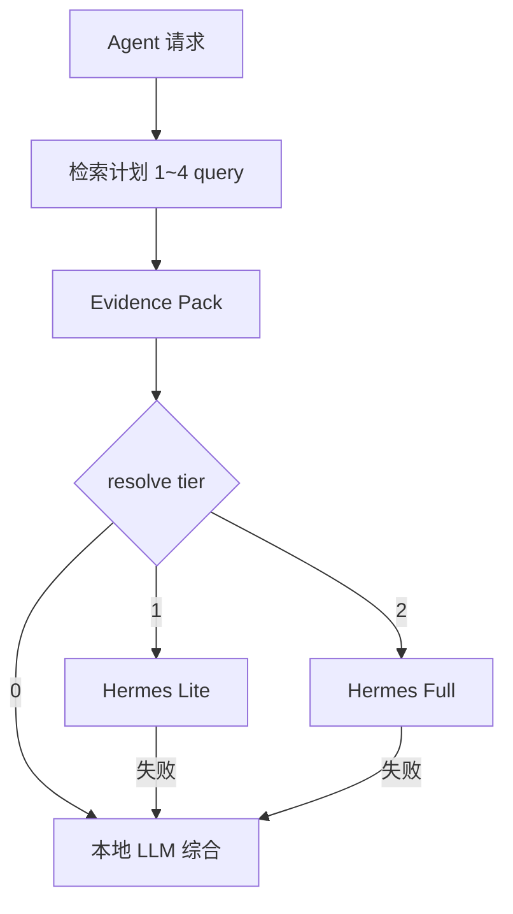

# Agent Evidence Pack 与 Tier 0–2 编排

**日期：** 2026-05-21  
**状态：** in progress  
**关联：** [1.2.3 Agent KB 分流](1.2.3-agent-kb-router-design.md)、[实施计划](../plans/1.2.3.b-agent-evidence-pack-tiers-plan.md)、[hermes.md](../../docs/hermes.md)

---

## 1. 目标

在保留 Hermes 处理复杂任务的前提下：

- **Orient-G 负责**：ACL、多 query 检索、Evidence Pack、覆盖率与缺项、Tier 0 本地综合；
- **Hermes 负责**：Tier 1 受限编排（补检索）、Tier 2 完整 Agent（写库、多工具、深度核实）；
- 适配 **大量 Docling 小节 doc**、流程 doc、大 Excel（table 证据并入 pack）。

**非目标：** 通用 NLU；替换 Hermes 框架；Hermes 源码改造（v1 以 prompt + context JSON 为主）。

---

## 2. Tier 定义

| Tier | 代号 | `agent_route` | 何时 | 行为 |
|------|------|---------------|------|------|
| 0 | 检索优先本地 | `fast` | **快速**强制；**auto** 在 pack 够且非多轮编排时 | 多 query → Evidence Pack → `synthesize_kb_reply`；`hermes_used=false` |
| 1 | Hermes 受限 | `hermes_lite` | **标准**固定；auto 证据不足 / 有 gaps | 注入 pack → Hermes SSE；`orientg_kb_ask_budget` ≤ N；禁 terminal |
| 2 | Hermes 完整 | `hermes_full` | `agent_mode=deep`、写库、无 KB | Runs API 多轮；条件触发网关补检索 |



---

## 3. Evidence Pack 结构（v1）

```json
{
  "version": 1,
  "task_type": "fact|compare|breakdown|process|general",
  "user_query": "...",
  "retrieval_queries": ["...", "..."],
  "facets": [
    {
      "label": "合并利润表",
      "doc_id": "ud_...",
      "chunk_id": "...",
      "excerpt": "...",
      "keywords_hit": ["销售费用", "营业收入"]
    }
  ],
  "gaps": ["未命中销售费用附注小节"],
  "coverage_score": 0.85,
  "citations": [],
  "reply": "混合检索摘要..."
}
```

- **facets**：供 Hermes / 本地 LLM 直接消费的节选（每 facet 可来自不同 doc chunk）；
- **gaps**：缺项列表，Tier 1 补检索应针对 gaps 换 query；
- **coverage_score**：0–1，路由 Tier 0 的主信号之一。

---

## 4. 多 query 检索计划

由 [`kb_retrieval_plan.py`](../../../backend/services/kb_retrieval_plan.py) 按 `task_type` 生成 1–4 条子 query（首条为用户原问）：

| task_type | 触发 | 额外子 query 示例 |
|-----------|------|-------------------|
| `breakdown` | 成本/费用/明细/拆解 | `{实体} 销售费用 附注`、`管理费用 附注`、`营业成本` |
| `compare` | 对比/两年/损益 | `{实体} 合并利润表 2024 2025` |
| `fact` | 单点事实 | 仅原问 |
| `process` | 流程/制度/审批 | 原问 + 可选「制度 流程」 |

各子 query 独立 `ask_knowledge`，citation 去重合并后建 pack。

---

## 5. 路由（相对 1.2.3 的变更）

**标准 / auto 默认（2026-06 实现）：**

1. 预检索 → pack；
2. **`agent_mode=standard` 且 Hermes 已配置 + 有 KB 范围 → 固定 Tier 1（`hermes_lite`）**，不因 pack 覆盖率够而降级 Tier 0；
3. **`agent_mode=auto`**：`simple_fast` 且简单问句 + pack 足够 → Tier 0；或 `HERMES_AGENT_STANDARD_TIER0=true` 且 pack 足够且非 `needs_hermes_orchestration` → Tier 0；否则 Hermes 可用 → Tier 1；
4. **`agent_mode=deep`** → **Tier 2**（`hermes_full`），不降级；
5. **`agent_mode=fast`** → 强制 Tier 0；
6. 写库 / 无 KB 等 → 见 [`agent_kb_router.py`](../../../backend/services/agent_kb_router.py)。

**快速模式：** 强制 Tier 0（证据不足时本地综合 + gaps 提示，不自动升 Hermes）。

**Hermes orchestration 信号：** 显式写库、用户选深度、`gaps` 非空且 compare/breakdown、或关闭 `HERMES_AGENT_STANDARD_TIER0`（仅影响 auto）。

---

## 6. 配置

| 变量 | 默认 | 含义 |
|------|------|------|
| `KB_MULTI_QUERY` / `HERMES_AGENT_KB_MULTI_QUERY` | `true` | 启用多 query 预检索（`KB_MULTI_QUERY` 优先） |
| `HERMES_AGENT_STANDARD_TIER0` | `true` | **仅 auto 模式**：pack 足够时走 Tier 0；**标准模式固定 Tier 1** |
| `HERMES_AGENT_KB_ASK_BUDGET_LITE` | `2` | Tier 1 补检索上限（v1.2.3.b 起建议 2） |
| `HERMES_AGENT_ROUTE_DEFAULT` | `tier0` | 文档语义；实现映射 `fast` |

---

## 7. SSE 元数据

`done` / `status` 增加：

- `agent_tier`: `0` | `1` | `2`
- `evidence_pack`: 精简版（`task_type`、`gaps`、`coverage_score`、`retrieval_queries`）

---

## 8. 测试

- `test_kb_retrieval_plan.py` — 计划生成；
- `test_evidence_pack.py` — pack 构建与 coverage；
- `test_kb_retrieve_pack.py` — 多 query 合并（mock ask）；
- `test_agent_kb_router.py` — **标准** + 足够 pack → **hermes_lite**（非 fast）；auto + 足够 pack → fast；
- `test_kb_cost_detail_pack.py` — 竞品财报文件夹：breakdown 问句命中销售费用附注 doc；
- `test_ai_interaction_kb_pack.py` — 对话页 `retrieve_kb_for_chat` 与 `evidence_pack` 响应；
- `test_kb_ask_budget.py` — Hermes 会话内 MCP `orientg_kb_ask` 次数上限。

---

## 9. 成功标准

- **快速** + 华清单点营收：Tier 0，&lt;120s；
- **标准** + 成本/费用对比报告：Tier 1（Hermes lite），含附注级证据或网关补检索修订；
- **自动** + pack 够的简单问句：可 Tier 0；
- **深度**模式：Tier 2，Runs + 可多轮 `orientg_kb_ask`（实测常 0 MCP，网关可条件补检索）；
- 文档：与 [1.2.3 分流](1.2.3-agent-kb-router-design.md) 交叉引用；**标准=Tier 1 固定**；**auto/快速** 可在 pack 够时 Tier 0。
