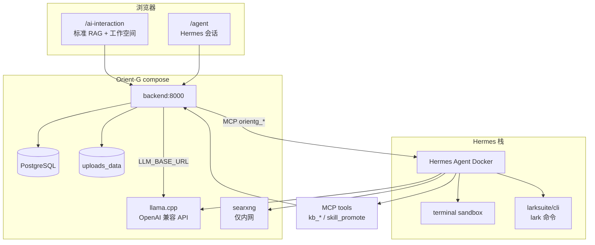

# 1.2.3 Hermes 融合 — 实施计划（v2 架构修订）

> **规制（v1 全文 + 修订摘要）**：[`specs/features/1.2.3-Hermes-Agent与Orient-G融合方案.md`](../features/1.2.3-Hermes-Agent与Orient-G融合方案.md)  
> **UI 规制（待新建）**：`specs/ui/1.2.3-agent-page.md`（与 AI 互动并列，非模式切换）  
> **Skill 规范**：[`docs/skills-guidelines.md`](../../docs/skills-guidelines.md)

**Goal:** 在内网生产机上，以 **独立 Agent 入口 + Orient-G MCP 网关** 集成 Hermes；支持知识库读写回写；二期 **SearXNG** + **[larksuite/cli](https://github.com/larksuite/cli)**；**用户通过 Agent 书写**的产品 Skill 经评审后固化（非 Hermes 内置 skill）。

**Architecture（v2）:**



**与 v1 草案差异（需重构）**

| 维度 | v1 草案 | v2（当前共识） |
|------|---------|----------------|
| LLM | Ollama | **llama.cpp（Docker）+ OpenAI 兼容 API**；Hermes 与 Orient-G 共用内网 `LLM_BASE_URL` |
| UI | AI 互动页内模式切换 | **侧栏并列入口**：`/ai-interaction` + **`/agent`** |
| KB | 只读 MCP / 挂卷 | **经 MCP 可读可写**（ACL + lifecycle + 审计） |
| Skill | Phase 3 模糊 | **双轨**：Hermes 运行时 skill ↔ 产品 `agent_skills` 登记晋升 |
| 工具 | 未列 | **SearXNG（内网）**、**Lark CLI（受控）**；禁止默认公网搜索 |
| Phase 0 | 未做财务任务 | **CLI 已可用** → 门禁改为「典型任务清单」而非「能否安装」 |

**Tech Stack:** Hermes Agent、Docker Compose、FastAPI、MCP、llama.cpp API、SearXNG（可选）、Lark CLI（可选）、现有 Docling/KB。

---

## 生产环境事实（已确认）

| 项 | 说明 |
|----|------|
| 硬件 | i7-11700K / 32GB / RTX 5080；与 Orient-G 同机 |
| 对话 LLM | **llama.cpp** 容器，经 **LLM API** 调用（非 Ollama） |
| 知识库文件 | 服务器 Docker 卷 `uploads_data` → `/app/uploads/kb_user_documents/...` |
| Hermes | 宿主机 **CLI 已可用**；生产交付仍走 **Docker + Web** |
| 数据边界 | **不出局域网**；SearXNG 仅内网实例；禁止 Hermes 默认外网模型 |

> **嵌入向量**：若仍用 `OLLAMA_URL` 仅做 embedding，与对话 llama.cpp **分离**；在 `.env` 文档中写清两套端点，避免混配。

---

## 已确认决策（2026-05-21）

| # | 决策 | 值 |
|---|------|-----|
| D1 | 首版范围 | **A**：MCP（含 KB 写）+ `/agent` + `/api/agent/chat`；**SearXNG / 飞书二期** |
| D2 | UI | **并列 `/agent`** |
| D3 | 部署 | 同机 Docker；Hermes 不映射公网端口 |
| D4 | LLM | **llama.cpp** OpenAI 兼容 API（`LLM_BASE_URL`） |
| D5 | KB 写回 | **默认允许**（Agent 页默认勾选；经 MCP，非裸写盘） |
| D6 | 飞书 | 首版不接；见下文「Hermes Docker + 飞书」预留 |
| D7 | Skill 固化 | 见下文 **§Skill 口径**（非 Hermes 内置/自进化 skill） |

---

## Phase 0（已基本满足）→ 改为「任务验证」

- [x] Hermes CLI 可用（你已安装）
- [ ] `docs/hermes.md` §6 验收清单：≥2 条典型财务任务（含 KB 读+写一条）
- [ ] Hermes 指向 **llama.cpp API** 的配置快照（脱敏）归档到运维文档
- [ ] **门禁**：完成 ≥2 条任务且 KB 回写路径明确 → 进入 Phase 1 开发

---

## Phase 1：Orient-G MCP（核心，TDD）

**原则：** Hermes **不**靠 RO 挂全盘 `uploads` 访问生产 KB；一律走 MCP，携带用户身份。

| MCP Tool | 作用 | 写库 |
|----------|------|------|
| `orientg_kb_ask` | 同 `ask_knowledge`，带 scope | 否 |
| `orientg_kb_list_docs` | 列文档/文件夹（ACL） | 否 |
| `orientg_kb_upload` | 上传文件进私人库并触发解析 | **是** |
| `orientg_kb_assign` | 文档/表归属 collection、绑文件夹 | **是** |
| `orientg_kb_import_artifact` | Agent 产物（xlsx/md）落库 | **是** |
| `orientg_skill_submit_draft` | 提交 **Orient-G 产品 Skill** 草稿（`SKILL.md` + 元数据）待审 | 元数据 |

**代码（建议路径）**

- `backend/mcp/orientg_server.py`
- `backend/services/hermes_client.py`
- `backend/services/agent_skill_promotion.py`（评审队列，可先 JSON 文件队列）
- `backend/tests/test_orientg_mcp_*.py`

**审计：** 所有 tool 调用写 `kb_audit_events` / 扩展 meta `channel: hermes.mcp.*`。

---

## Phase 1b：内网工具链（compose 扩展，开关控制）

| 服务 | 用途 | 安全 |
|------|------|------|
| `searxng` | Hermes 网页检索 | 仅 `127.0.0.1` 或 docker 内网；**禁用**默认公网引擎或仅内网源 |
| `hermes-agent` | Agent 运行时 | `terminal.backend: docker`；`mem_limit`；与 llama.cpp 网络互通 |
| **[larksuite/cli](https://github.com/larksuite/cli)** | 飞书文档/多维表/日程（`lark` 命令） | 独立配置卷 + 沙盒内 allowlist；**非** Hermes 内置 `feishu_*` toolset |

`.env` 建议：

```env
HERMES_ENABLED=false
HERMES_SEARXNG_ENABLED=false
HERMES_LARK_CLI_ENABLED=false   # larksuite/cli，非 Hermes feishu_doc_*
LLM_BASE_URL=http://llamacpp:8080/v1   # 示例，以你实际服务名为准
```

---

## Phase 2：产品入口 `/agent`（并列 AI 互动）

**导航：** `DashboardLayout` 增加 `{ href: "/agent", label: "Agent", icon: Bot }`，与「AI 互动」同级。

**页面（新建 `frontend/app/agent/page.tsx`）**

- 对话区（可复用 ai-interaction 消息组件样式，见未来 `specs/ui/1.2.3-agent-page.md`）
- **知识库范围**选择器（复用 `kb_scope_capsule` / folder picker 逻辑）
- **附件**与「允许写回知识库」勾选（默认开，可配策略）
- 可折叠 **执行步骤**（`tool_calls`）
- 产物下载 + 「存入知识库」状态

**API**

- `POST /api/agent/chat`（网关 → **`hermes_client` 内网 HTTP**，不用 `docker exec` 主线）
- `GET /api/agent/sessions`（可选，后端映射 `hermes_session_id`）
- `GET /api/agent/models` → 代理 llama.cpp / 与 ai-interaction 一致

**不改：** `/ai-interaction` 保持标准模式；工作空间 Tab 仍管 bigpdf/提示词等。

---

## §Skill 口径（已明确，避免与 Hermes 内置 skill 混淆）

| 概念 | 是否固化到网站 | 说明 |
|------|----------------|------|
| Hermes **内置 / 自进化** skill | **否** | 留在 Hermes `~/.hermes` 运行时；不进入 `agent_skills/manifest.json` |
| 用户通过 **调用 Hermes（/agent）书写** 的 Skill | **是（经评审）** | 例如：「帮我写一个企业内网用的 SKILL：从合同 PDF 生成台账」→ 产出符合 agentskills.io 的 `SKILL.md` 草稿 |
| Orient-G **产品 Skill** | **是** | 评审通过后写入 `backend/data/agent_skills/<skill_id>/` + [`manifest.json`](../../backend/data/agent_skills/manifest.json)；由 **Python Handler** 在 AI 互动/工作空间执行，**运行时不再调 Hermes** |

```text
/agent 用户任务 → Hermes 编排（可用 orientg_kb_* 等 MCP）
    → 生成 SKILL.md 草稿 + 可选「实现说明」
    → orientg_skill_submit_draft（MCP）
    → 管理端评审
    → 研发实现/挂接 skill.<domain>.<name>.v1 Handler
    → 网站功能勾选该 skill（与现有 skill.data_parse.* 同级）
```

**首版（Phase 1）可不实现** `orientg_skill_submit_draft`，但架构与 MCP 命名按此预留。

---

## Hermes Docker 部署后，飞书怎么配？（二期，先写清路径）

### 名称核实（你本机「已配给 hermes cli」多半指这个）

Hermes **通常没有**单独一个叫 `lark` 的可执行文件；飞书能力是：

| 名称 | 含义 |
|------|------|
| **`hermes` CLI** | 交互入口；默认 toolset 为 **`hermes-cli`** |
| **`hermes-feishu`** | 飞书 **机器人 / Gateway** 用的 platform toolset（消息通道） |
| **`feishu_doc` / `feishu_drive`** | 文档/云盘 **工具**（如 `feishu_doc_read`、`feishu_drive_*`）；部分仅 comment-handler 暴露 |
| **环境变量** | `FEISHU_APP_ID`、`FEISHU_APP_SECRET`、`FEISHU_DOMAIN=feishu\|lark` 写在 **`~/.hermes/.env`** |

官方文档：[Feishu / Lark | Hermes Agent](https://hermes-agent.nousresearch.com/docs/user-guide/messaging/feishu)  
配置示例：`hermes gateway setup` 选 Feishu/Lark，或手动写入 `~/.hermes/.env`。

Orient-G 仓库内另有 **`backend/services/feishu_sync.py`**（流程文档同步 API），与 Hermes toolset **不是同一条链路**；二期可二选一或并存（MCP 统一出口）。

### 宿主机 CLI → Docker Hermes 迁移（二期推荐做法）

你当前在**宿主机**上的 `~/.hermes/.env`（含 `FEISHU_*`）在 Hermes 进容器后**不会自动继承**，需显式迁移：

**方案 1（推荐）：Secret 卷 + 环境变量**

```yaml
# compose 片段（二期）
hermes-agent:
  image: hermes-agent:local
  env_file: .env.hermes          # 仅 FEISHU_*、LLM_*，不进 Git
  volumes:
    - hermes_state:/root/.hermes # 会话/记忆；首启可从宿主机备份迁入
  networks: [orientg_internal]
  # 不 ports 映射到宿主机
```

将宿主机 `~/.hermes/.env` 中飞书相关项复制到 **`.env.hermes`**（Portainer / 运维保管）。

**方案 2：挂载状态目录（从宿主机迁态）**

```yaml
volumes:
  - /opt/hermes-state:/root/.hermes:rw   # 含 .env、state.db；注意权限与备份
```

**方案 3（与 Orient-G 统一，最安全）：Orient-G MCP 调飞书**

Hermes **不直接持飞书凭证**；二期增加 MCP tool `orientg_feishu_*`，内部复用 `feishu_sync` 或飞书 Open API。Hermes 只调 MCP，凭证只在 **backend**。

| 方案 | 适用 |
|------|------|
| 1 / 2 | 要继续用 Hermes 原生 `feishu_doc_*` 工具 |
| 3 | 强审计、与《规则》一致；**长期推荐** |

**首版 A** 不启用飞书；Docker 化 Hermes 时只需：`LLM_BASE_URL`、`orientg` MCP、**不要**先挂 `FEISHU_*`，避免误连公网飞书。

### 启用 Hermes 飞书 toolset（二期、若用方案 1/2）

在 Hermes 配置中允许 toolsets（以你锁定的 Hermes 版本文档为准），并确认 Agent 会话使用的 preset 含所需 `feishu_*` 工具；`feishu_drive_*` 在部分版本**不**在默认 `hermes-cli` 上暴露，需查 [toolsets reference](https://hermes-agent.nousresearch.com/docs/reference/toolsets-reference)。

---

## Phase 3：Skill 固化（产品化，可晚于首版）

见 **§Skill 口径**。实现 `orientg_skill_submit_draft` + 管理端评审 UI。

- 遵循 [`docs/skills-guidelines.md`](../../docs/skills-guidelines.md)。

---

## Phase 4（后续）

- SSE/WebSocket 长任务
- Agent 会话与「工作空间」深度联动（从工作空间一键带 scope 打开 `/agent`）
- 飞书回写结果链接展示在 citations

---

## 风险（v2）

| 风险 | 缓解 |
|------|------|
| Lark CLI 把内网数据推到飞书云 | 开关 + 审批 + 仅允许指定 app/tenant；审计 |
| SearXNG 误配公网引擎 | 内网 compose + 配置评审 |
| Hermes 写盘绕过 ACL | 禁止 RO 挂 `uploads` 作为唯一写路径；写必须 MCP |
| llama.cpp 与 Docling/Hermes 抢 GPU | 分时/限并发；5080 显存监控 |
| Skill 未经审核进 manifest | 仅 `skill_promote` 人工合并 |

---

## 推荐实施顺序（供你最终拍板）

1. **Phase 1 MCP**（含 KB 写）+ **Phase 2 `/agent` 最小页** — 核心价值闭环  
2. **Phase 1b** SearXNG / Lark — 按开关逐个开  
3. **Phase 3** Skill 晋升 — 有重复任务后再做  

**状态：** Phase 1 MCP + Phase 2 `/agent` 最小闭环**已落地**（2026-05-21）；待 Hermes 容器联调（`HERMES_ENABLED=true`）。

### 已落地文件

| 路径 | 说明 |
|------|------|
| `backend/services/orientg_mcp_tools.py` | MCP 工具实现（ACL 读/写分离 + 审计） |
| `backend/mcp/orientg_server.py` | stdio MCP Server（`python -m backend.mcp.orientg_server`） |
| `backend/services/hermes_client.py` | 内网 HTTP → `{HERMES_BASE_URL}/v1/agent/run` |
| `backend/routers/agent.py` | `GET /api/agent/status`、`POST /api/agent/chat` |
| `frontend/app/agent/page.tsx` | Agent 页（并列 AI 互动） |
| `docs/hermes.md` | Hermes 联调唯一操作指南（开发 §2 / 生产 §3） |
