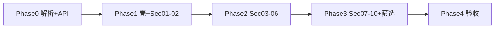

# 竞品财报可视化 Implementation Plan

> **For agentic workers:** REQUIRED SUB-SKILL: Use superpowers:subagent-driven-development (recommended) or superpowers:executing-plans to implement this plan task-by-task. Steps use checkbox (`- [ ]`) syntax for tracking.

**Goal:** 财务后台（任意 `finance_path`）上传行业财报汇析 MD → 解析为 **竞品财报** Snapshot → 侧栏 `/competitor` 展示 **9 屏** Recharts 页（`sec-09` 含 `sec-09-10`～`15` 子锚点）。

**Architecture:** Python MD 解析器 → JSON Snapshot 存盘（全局单例，与 URL 无关）→ FastAPI → Next.js `/competitor`。财务后台 canonical `/finance` + `middleware.ts` rewrite 自定义路径。

**Tech Stack:** FastAPI、pytest、Next.js App Router、Recharts 2.x、Tailwind、（可选）d3-sankey

**Design:** [1.2.3.c-竞品财报可视化.md](../features/1.2.3.c-竞品财报可视化.md) · **UI:** [1.2.3.c-竞品财报可视化-ui.md](../ui/1.2.3.c-竞品财报可视化-ui.md)

---

## File map

| 文件 | 职责 |
|------|------|
| `backend/services/competitor_report_parser.py` | **新建** MD → Snapshot |
| `backend/services/competitor_report_store.py` | **新建** 读写 snapshot/raw |
| `backend/routers/competitor.py` | **扩展** summary + report + admin upload |
| `backend/tests/test_competitor_report_parser.py` | **新建** 解析单测 |
| `backend/tests/test_competitor_report_api.py` | **新建** upload/GET 集成测 |
| `backend/tests/fixtures/competitor_report_yycq.md` | **新建** 蓝本副本（或 symlink 说明） |
| `frontend/middleware.ts` | **已启用** `finance_path` rewrite（自定义路径 → `/finance`） |
| `frontend/app/components/DashboardLayout.tsx` | **修改** 「竞品财报」移入 `view_business_dashboard` 条件组 |
| `frontend/app/components/AuthGuard.tsx` | **修改** `/competitor` 无权限时重定向 |
| `frontend/app/contexts/AuthContext.tsx` | 暴露 `finance_path` 供内链 |
| `frontend/app/finance/page.tsx` | **修改** 第四块：竞品财报 MD 上传 |
| `frontend/app/competitor/page.tsx` | **修改** 替换占位为 scroll-snap 壳 |
| `frontend/app/competitor/lib/*` | **新建** fetch、selectors、format |
| `frontend/app/competitor/components/ProgressScale.tsx` | **新建** 左侧刻度（主圆点 + 细分小点） |
| `frontend/app/competitor/components/charts/*` | **新建** Recharts 封装 |
| `frontend/app/competitor/sections/Sec0*.tsx` | **新建** 10 屏 section |
| `frontend/app/lib/competitor_chart_colors.ts` | **新建** 8 公司色（引用 BUSINESS_CHART_COLORS 主色） |
| `specs/api/api-contract.md` | **补丁** §竞品财报 API |

---

## Phase 0 — 解析器与存储（TDD）

### Task 0: 财务后台路径 middleware（前置）

- [x] 启用 `frontend/middleware.ts`（自 `proxy.ts` 迁移逻辑）
- [x] `AuthGuard` 仅按 `pathname === finance_path` 鉴权；`AuthContext.finance_path`
- [x] **RBAC**：`DashboardLayout` 竞品财报仅 `view_business_dashboard`；`AuthGuard` 拦截 `/competitor`
- [ ] 手测：改 `finance_path` 为 `/finance_ops` → 新路径可进财务后台、`/finance` 404

### Task 1: Snapshot 类型与存储

- [x] `competitor_report_store.py`：`save_snapshot(raw_bytes, snapshot)` / `load_snapshot()` / `load_meta()`
- [x] 目录 `{upload_dir}/competitor/`，与 `settings.upload_dir` 一致
- [x] `test_competitor_report_store.py` 临时目录单测

### Task 2: MD 解析器骨架

- [x] `test_competitor_report_parser.py`：fixture 加载 YYCQ 蓝本
- [x] 断言：`len(sections)==10`，`companies` 含 8 家，`sec-01-2` 表存在
- [x] `competitor_report_parser.py`：锚点切分、GFM table、meta
- [x] 跑通测试

### Task 3: 数值清洗与容错

- [x] 测试：千分位、`%`、`—`、括号负数
- [x] 测试：双值粘连启发式 + warning
- [x] 测试：`||` 表头容错
- [x] 实现 `parse_cell_value` / `split_dual_values`

### Task 4: API

- [x] `POST /api/competitor/admin/upload` — `_require_admin`
- [x] `GET /api/competitor/report`、`/summary`、`/report/meta` — `_require_view_business_dashboard`
- [x] 更新 `GET /api/competitor/summary` 响应为 Snapshot meta 形状
- [x] `test_competitor_report_api.py`：upload → get 200；无权限 403；无文件 404

---

## Phase 1 — 前端壳 + 财务上传 + 前两屏

> 实施前 **Read** `~/.cursor/skills/frontend-design/SKILL.md`（Orient-G 约束）

### Task 5: 财务后台上传 UI（第四块 card）

- [x] `finance/page.tsx` 新增 **「上传竞品财报汇析（Markdown）」** card
- [x] 调用 `POST /api/competitor/admin/upload`；成功展示 warnings + 链 `/competitor`
- [ ] 手测：在 **自定义 `finance_path`** 下上传 MD，`/competitor` 仍可见数据

### Task 6: `/competitor` 数据层

- [x] `useCompetitorReport.ts` fetch `/api/competitor/report`
- [x] 空态 / 加载 / 错误态
- [x] `selectors.ts`：`getTable(snapshot, 'sec-01-2')`

### Task 7: Scroll-snap 壳 + ProgressScale

- [x] `page.tsx`：snap 容器 + 10 屏细分 `SnapPanel` 锚点
- [x] `ProgressScale.tsx`：左侧主圆点 + 细分小点；hover 显示标题；点击跳转；当前亮起
- [x] Sticky header：仅「竞品财报」主标题（无副标题）
- [x] 刻度位于 **main 内容区内**（`absolute left-*`），不与 Dashboard 侧栏重叠

### Task 8: Sec01 行业总览

- [x] 营收横向 `BarChart` — sec-01-2
- [x] `KPICard.tsx` — sec-01-1 指标表
- [x] 商业模式卡 — sec-01-3（`BusinessModelCards` 内联于 Sec01）
- [x] 8 公司色板 `competitor_chart_colors.ts`
- [x] 分析 narrative 融入 hero lead + 内联引用块

### Task 9: Sec02 综合排名

- [x] 排名横向 `BarChart` — sec-02-1
- [x] `RadarChart` — sec-02-2（0–100 五轴）
- [x] 折叠面板：评分权重说明
- [x] 一句话研判 InsightCards

**Phase 1 完成标准：** 上传 MD → 前两屏图表与蓝本抽样一致；进度轴可导航。

---

## Phase 2 — 核心财务屏（sec-03 ~ sec-06）

### Task 10: Sec03 经营成果

- [x] 公司指标小卡 grid — sec-03-1
- [x] 营收/净利组合柱 — sec-03-1
- [x] 象限卡片 — sec-03-3

### Task 11: Sec04 人员人效

- [x] 人员结构 100% 堆叠条 — sec-04-4
- [x] 人效散点 — sec-04-2

### Task 12: Sec05 收入成本

- [x] v1：产品类型分组柱 + 毛利率折线（sec-05-1）
- [ ] 桑基图 **可选**；不足则 plan 标记 v1.1

### Task 13: Sec06 资产负债表

- [x] 资产环形 `PieChart` innerRadius — sec-06-1（按筛选公司）
- [x] 杜邦横向条 — sec-06-4

---

## Phase 3 — 剩余屏 + 交互（sec-07 ~ sec-10）

### Task 14: Sec07 ~ Sec08

- [x] 费用率堆叠条 + 趋势 — sec-07-3/4
- [x] 现金流对比 + CF/净利 gauge 条 — sec-08-2

### Task 15: Sec09 ~ Sec10

- [x] sec-09：ROI/广告表 + narrative
- [x] sec-10：风险热力 grid — sec-10-1
- [x] R&D 资本化表 — sec-10-2

### Task 16: 全局公司筛选

- [x] ~~Header Select~~ **v1 已取消**（产品决策：不做公司筛选）
- [x] 图表始终展示全部公司

### Task 17: 性能与懒加载

- [x] `dynamic()` 按 section 懒加载 chart 包（sec-03~10）
- [x] `LazySection` IntersectionObserver 离屏延迟挂载

---

## Phase 4 — 文档、契约、验收

### Task 18: API 文档

- [x] 更新 `specs/api/api-contract.md` §竞品财报（含 Snapshot 类型）
- [x] README 一句：竞品财报页数据来源

### Task 19: 验收脚本

- [x] 集成测试 `test_competitor_report_api.py`：admin upload + GET assert sections（替代一次性 smoke 脚本）
- [ ] 更新 `docs/finance-agent-acceptance-matrix.md` 增加「可视化页」抽检项（可选）

### Task 20: 浏览器抽检清单

- [ ] 登录 admin → **财务后台**（当前 `finance_path`，含自定义 alias）上传 MD
- [ ] `/competitor`：10 屏导航、sec-01 KPI、sec-02 雷达、公司筛选
- [ ] 回归：修改 `finance_path` 后上传与展示仍正常
- [ ] 移动端：进度轴降级为顶栏横条（<768px）

---

## 依赖与顺序

- **不可并行：** Task 4 完成前不做 Task 6+
- **可并行：** Phase 2 各 Sec 组件彼此独立（不同文件）

---

## 提交粒度建议

1. `feat(competitor): parser + store + tests`
2. `feat(competitor): admin upload API`
3. `feat(finance): competitor MD upload UI`
4. `feat(competitor): scroll-snap shell + progress axis`
5. `feat(competitor): sec01-sec02 charts`
6. … 每屏或两屏一个 PR

---

## 风险缓冲

- 若 Phase 2 超时：**先** sec-03/04（经营+人效），sec-05 桑基降级为表格
- 解析 dual-value 误判：warnings 可见 + 财务可改 MD 重传
